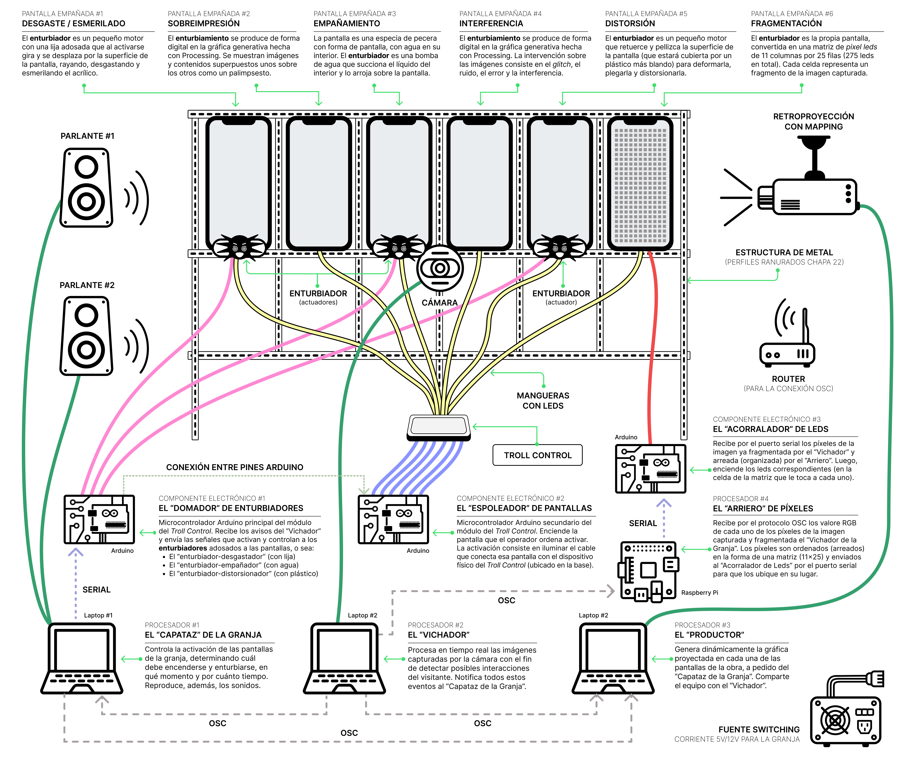

# Rebelión en la Granja de Clics
Una distopía orwelliana que adopta la forma de una "*Granja de Clics*" para hablar de la manipulación y los falsos discursos que encubren una maquinaria turbia, opaca y poco sustentable. La granja, como un sistema precarizado de engaños, montado con la intención de subvertir los controles impuestos por los algoritmos de las grandes corporaciones tecnológicas pero que, con cada clic, devienen también en turbios dispositivos de explotación.

> Trabajo práctico de cierre del año 2025 - MAE, UNTREF
> Realizado en colaboración con Diego Flores

# La Obra
Montadas en una estructura de soportes de chapa que remite a una granja de clics, las pantallas de los dispositivos personales son presentadas como las ventanas hacia los mundos digitales que habitamos y que, intencionalmente, son veladas, tapiadas, desgastadas, embadurnadas o fragmentadas en aras de una nueva “invisualidad” que impide ver con claridad más allá de sus marcos. Son superficies empañadas y distorsionadas que, en lugar de abrirse y promover un acceso transparente a los datos, procuran filtrar o directamente ocultar aquello que ocurre, puertas adentro, en las cocinas de Silicon Valley.

# La Instalación
La instalación de la obra es una especie de parrilla metálica construida con perfiles ranurados de chapa 22 que evoca a la estructura de las "granjas de clics" sobre la que se montan seis pantallas de acrílico.

## Las Pantallas Empañadas
Cada pantalla tiene algún tipo de operación de empañamiento, ya sea mediante la gráfica generativa o a través de algún dispositvo **enturbiador** adosado a la estructura. En esta primera versión de la obra, la instalación cuenta con seis pantallas ("*Media docena de empañadas*") sujetas a la estructura de la granja*. 

- **PANTALLA #1 - DESGASTE/ESMERILADO**: El **enturbiador** es un pequeño motor con una lija adosada que al activarse gira y se desplaza por la superficie de la pantalla, rayando, desgastando y esmerilando el acrílico.
- **PANTALLA #2 - SOBREIMPRESIÓN**: El **enturbiamiento** se produce de forma digital en la gráfica generativa hecha con Processing. Se muestran imágenes y contenidos superpuestos unos sobre los otros como un palimpsesto.
- **PANTALLA #3 - EMPÑAMIENTO**: La pantalla es una especia de pecera con forma de pantalla, con agua en su interior. El **enturbiador** es una bomba de agua que succiona el líquido del interior y lo arroja sobre la pantalla.
- **PANTALLA #4 - INTERFERENCIA**: El **enturbiamiento** se produce de forma digital en la gráfica generativa hecha con Processing. La intervención sobre las imágenes consiste en el *glitch*, el ruido, el error y la interferencia.
- **PANTALLA #5 - DISTORSIÓN**: El **enturbiador** es un pequeño motor que retuerce y pellizca la superficie de la pantalla (que estará cubierta por un plástico más blando) para deformarla,  plegarla y distorsionarla.
- **PANTALLA #6 - FRAGMENTACIÓN**: El **enturbiador** es la propia pantalla,  convertida en una matriz de pixel leds de 11 columnas por 25 filas (275 leds en total). Cada celda representa un fragmento de la imagen capturada.

> (*) En una versión posterior, se propone incorporar seis pantallas adicionales para llegar a la docena completa de *empañadas*.

## Los Procesadores
La obra cuenta con cuatro **procesadores** responsables de la ejecución de los programas que asumen los roles principales de "Capataz", "Vichador", "Productor" y "Arriero". Si bien esta arquitectura hace una separación lógica de los procesadores según la función que desempeñan en la granja, la instalación podría simplificarse utilizando tan sólo dos computadoras/laptops físicas donde corran estos procesadores:
- **PROCESADOR #1 - EL "CAPATAZ"**: orquestador y domador de los enturbiadores. Responsable de su activación/desactivación en cada una de las pantallas. También se ocupa de reproducir los sonidos de la granja.
- **PROCESADOR #2 - EL "VICHADOR"**: a través de una cámara dispuesta en el centro de la estructura, captura las imágenes del entorno y detecta los eventos del visitante que deban ser notificados al "Capataz". También lleva a cabo al fragmentación de la imagen de video capturada para mostrar en la "Pantalla #6".
- **PROCESADOR #3 - EL "PRODUCTOR"**: responsable de producir la gráfica generativa para cada una de las pantallas de la instalación, excepto para la "Pantalla #6". Las intervenciones sobre la gráfica responden, también, a las órdenes impartidas por el "Capataz" de la granja (recibidas por OSC).
- **PROCESADOR #4 - EL "ARRIERO"**: se ocupa de recibir la información de los píxeles de la imagen fragmentada por el "Vichador" y de alguna forma los "arrea" u ordena para acomodarlos en la matriz de leds (11x25). Los píxeles organizados son, luego, derivados al "Acorralador" para que los ubique en el lugar que le corresponde a cada uno de ellos (en su celda o "corral" de la pantalla-matriz).

